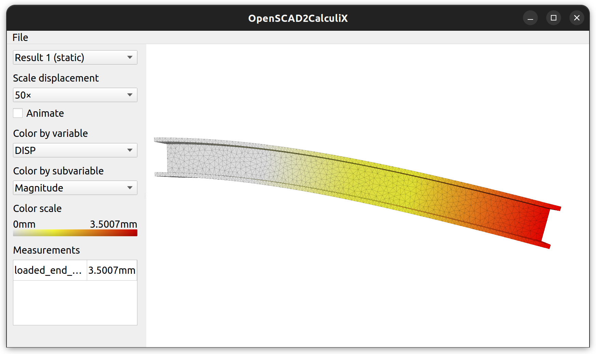

OS2CX (short for "OpenSCAD-to-CalculiX") integrates the popular open-source CAD
package [OpenSCAD](http://www.openscad.org/) with the open-source analysis
package [CalculiX](http://www.calculix.de/). OpenSCAD lets the user generate 3D
models defined using a text-based input language. CalculiX simulates 3D models
to predict physical properties such as strength, stiffness, etc. using finite
element analysis. OS2CX interfaces OpenSCAD and CalculiX together, so that 3D
models generated in OpenSCAD can be simulated in CalculiX.

OS2CX is an experimental, alpha-quality project. It's not particularly
well-tested, and results may not be accurate. Don't use it for anything
important!

# Example

Suppose we want to calculate how much a 1-meter steel I-beam would flex if we
anchored one end firmly in concrete and hung a 1-metric-ton car from the other
end. We can model this I-beam in OpenSCAD like so:

```openscad
length = 1;
width = 0.1;
height = 0.1;
thickness = 0.01;

module i_beam() {
    cube([length, thickness, height], center=true);
    translate([0, 0, height/2-thickness/2])
        cube([length, width, thickness], center=true);
    translate([0, 0, -height/2+thickness/2])
        cube([length, width, thickness], center=true);
}
```

Next, we need to tell OS2CX the parameters of the simulation. We do this using
modules that OS2CX adds to OpenSCAD via a `openscad2calculix.scad` helper
library:

```openscad
include <../openscad2calculix.scad>

/* Declares a new mesh object in OS2CX. Its name will be "i_beam", and its shape
comes from the the OpenSCAD i_beam() module we defined above. */
os2cx_mesh("i_beam") {
  i_beam();
}

/* Declares two selection objects in OS2CX. A selection object refers to part of
the surface or volume of a mesh object. It's defined by taking the intersection
of the declared mesh, with another OpenSCAD shape. */
os2cx_select_surface("anchored_end", [-1, 0, 0], 45) {
    translate([-length/2, 0, 0])
        cube([0.1, width+0.1, height+0.1], center=true);
}
os2cx_select_volume("loaded_end") {
    translate([length/2, 0, 0])
        cube([0.1, width+0.1, height+0.1], center=true);
}

/* Declares a load object in OS2CX, called "car_weight". It's defined as a
force of 9,800 newtons in the -Z direction, applied uniformly over the
"loaded_end" volume we defined above. */
weight = 1000;
gravity = 9.8;
os2cx_load_volume(
    "car_weight",
    "loaded_end",
    force_total=[[0, 0, -gravity*weight], "N"]);

/* Declares a material object in OS2CX, called "steel". It has a Young's modulus
of 209 gigapascals, and a Poisson's ratio of 0.3. */
os2cx_material_elastic_simple(
    "steel",
    youngs_modulus=[209, "GPa"],
    poissons_ratio=0.3,
    density=[7600, "kg/m^3"]);

/* Tell OS2CX to do a simple static deflection analysis using the objects we
just defined */
os2cx_analysis_static_simple(
    mesh="i_beam",
    material="steel",
    fixed="anchored_end",
    load="car_weight",
    length_unit="m"
);

/* Tell OS2CX to report the maximum deflection of the loaded end. */
os2cx_measure(
    "loaded_end_deflection",
    "loaded_end",
    "DISP");
```

Let's save this file as [example.scad](docs/example.scad) and open it using the
OpenSCAD2CalculiX GUI application. After a few seconds of calculation, OS2CX
will show us the results:



The bending is exaggerated by a factor of 50 in the visualization. Consulting
the color scale on the left-hand side, we can see that the beam would bend
approximately 3.50 millimeters. Theory predicts 3.48 millimeters; not bad!

# Installing and running

OS2CX has been tested on Linux (Ubuntu 22.04). The dependencies are all
cross-platform, so in principle it should be easy to get it working on other
operating systems, but no guarantees.

Dependencies:
* OpenSCAD 2021.01 (`sudo apt install openscad`)
* CalculiX 2.17 (`sudo apt install calculix-ccx`)
* Qt 5.15
* CGAL 5.4 (`sudo apt install libcgal-dev`)
* tetgen 1.5.0 (as a library, not an executable)
  (`sudo apt install libtet1.5-dev`)
* GLU (`sudo apt install libglu-dev`)
* Google Test (`sudo apt-get install libgtest-dev`)

Development notes:
* I develop OS2CX using Qt Creator.
* It's structured as a top-level QMake project with three sub-projects: a `core`
  project that contains the main logic, a `gui` project that defines the GUI
  application, and a `test` project that defines tests for `core`.
* Only `gui` makes significant use of Qt. `core` and `test` use nothing from Qt
  except QProcess.
* The test executable must be executed in the toplevel `os2cx/` directory.
